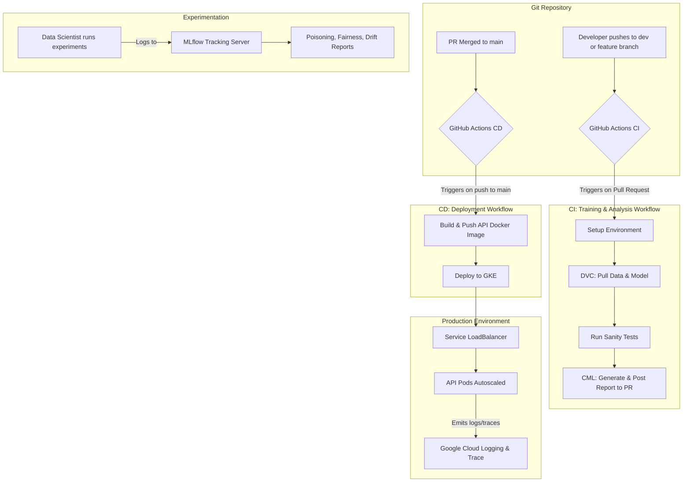

# End-to-End MLOps Pipeline for Production-Grade Fraud Detection

This repository contains a complete, production-grade MLOps pipeline for a financial fraud detection model. The project demonstrates a full lifecycle approach to machine learning, incorporating best practices for data versioning, advanced experiment tracking, CI/CD, containerized deployment on Kubernetes, and comprehensive model analysis.

## ✨ Core Features

- **Data & Model Versioning**: Utilizes DVC for reproducible data and model version control, integrated with Google Cloud Storage
- **Experiment Tracking**: Leverages MLflow as a central hub to track, compare, and visualize all experiments, including model parameters, metrics, and artifacts
- **CI/CD Automation**: Implements robust CI/CD workflows using GitHub Actions and CML (Continuous Machine Learning) for automated testing and deployment
- **Containerization**: The inference API is built with FastAPI and containerized using Docker for portability and scalability
- **Scalable Deployment**: Deploys the model as a microservice on Google Kubernetes Engine (GKE), complete with autoscaling capabilities
- **Observability & Monitoring**: Features structured JSON logging and distributed tracing with OpenTelemetry, fully integrated with Google Cloud's Operations Suite (Logging & Trace)
- **Load Testing**: Designed for performance validation using tools like wrk or hey to trigger and test the Horizontal Pod Autoscaler (HPA)

### Advanced Model Analysis

The pipeline includes dedicated experiments for in-depth model validation:

- 🛡️ **Data Poisoning Attacks**: Simulates adversarial attacks by poisoning the training data to measure model robustness and performance degradation
- ⚖️ **Fairness & Explainability**: Audits the model for bias across synthetic sensitive groups using Fairlearn and explains individual predictions with SHAP
- 🌊 **Data Drift Detection**: Proactively monitors for feature and target distribution shifts between datasets using Evidently AI

## 🏗️ Solution Architecture

The pipeline is split into two main automated workflows: Continuous Integration (CI) for testing and analysis, and Continuous Deployment (CD) for releasing the model to production.



## 🚀 Getting Started: Setup and Installation

Follow these steps to set up the project environment.

### 1. Clone the Repository

```bash
git clone https://github.com/pacificrm/MLOPS-Full-Data-Pipeline
cd MLOPS-Full-Data-Pipeline
```

### 2. Create and Activate Conda Environment

Using a dedicated Conda environment is crucial to manage dependencies.

```bash
conda create -n mlpipeline python=3.10 -y
conda activate mlpipeline
```

### 3. Install Dependencies

```bash
pip install -r requirements.txt
```

### 4. Configure DVC Remote Storage

Point DVC to your Google Cloud Storage bucket.

```bash
# Replace with your actual GCS bucket URI
dvc remote add -d myremote gs://your-gcs-bucket-name/dvc
```

### 5. Pull Versioned Data

Download the data, models, and other artifacts tracked by DVC.

```bash
dvc pull
```

## 🔬 How to Run the Experiments

All experiments are tracked using MLflow. Start the MLflow UI first to visualize the results in real-time.

```bash
# Start the MLflow server in a separate terminal (e.g., using 'screen')
mlflow ui --host 0.0.0.0 --port 8000
```

### 1. Train the Baseline Model

This script trains the initial model and logs it to MLflow.

```bash
python train.py
```

### 2. Data Poisoning Impact Analysis

This experiment analyzes the model's robustness against adversarial data poisoning attacks.

```bash
python poison_experiment.py
```

**Output**: A new experiment in MLflow named "Fraud Detection - Poisoning Impact" with a run for each poison level and a final summary report.

### 3. Fairness & Explainability Analysis

This script audits the model for fairness and generates SHAP plots for explainability.

```bash
python fairness_experiment.py
```

**Output**: A run in the "Fraud Detection - Fairness & Explainability" experiment containing a detailed HTML fairness report and SHAP plots as artifacts.

### 4. Data Drift Detection

This script compares two data versions to detect feature and target drift using Evidently.

```bash
python drift_analysis.py
```

**Output**: An interactive HTML drift report logged to the "Fraud Detection - Data Drift Analysis" experiment in MLflow.

## 🚢 Deployment to Google Kubernetes Engine (GKE)

The trained model is deployed as a containerized API on GKE.

### 1. Build and Push the Docker Image

```bash
# Authenticate Docker with Google Artifact Registry
gcloud auth configure-docker us-central1-docker.pkg.dev

# Build the image
docker build -t fraud-app .

# Tag the image
docker tag fraud-app us-central1-docker.pkg.dev/your-gcp-project-id/my-repo/fraud-app:latest

# Push the image
docker push us-central1-docker.pkg.dev/your-gcp-project-id/my-repo/fraud-app:latest
```

### 2. Deploy to GKE

The GitHub Actions CD pipeline automates this step. To do it manually:

```bash
# Get cluster credentials
gcloud container clusters get-credentials oppe2-demo-cluster --zone=us-central1-a

# Apply all Kubernetes manifests
kubectl apply -f k8s/
```

This will create the Deployment, Service, HorizontalPodAutoscaler, and ServiceAccount defined in the `k8s/` directory.

### 3. Load Testing

Once the service is deployed and has an external IP, you can trigger the autoscaler with a load testing tool to validate performance and scaling.

#### a. Get Service IP

First, find the external IP address of your service.

```bash
kubectl get service -n oppe2-app
```

#### b. Install wrk

Install the wrk load testing tool. On Debian/Ubuntu:

```bash
sudo apt-get update && sudo apt-get install -y wrk
```

#### c. Create a Lua Script for POST Requests

wrk needs a simple Lua script to send POST requests with a JSON body. Create a file named `post.lua` with the following content:

```lua
-- post.lua
wrk.method = "POST"
wrk.headers["Content-Type"] = "application/json"
wrk.body   = '{"V1": -1.35, "V2": -0.07, "V3": 2.53, "V4": 1.37, "V5": -0.33, "V6": 0.46, "V7": 0.23, "V8": 0.09, "V9": 0.36, "V10": 0.09, "V11": -0.55, "V12": -0.61, "V13": -0.99, "V14": -0.31, "V15": 1.46, "V16": -0.47, "V17": 0.20, "V18": 0.02, "V19": 0.40, "V20": 0.25, "V21": -0.01, "V22": 0.27, "V23": -0.11, "V24": 0.06, "V25": 0.12, "V26": -0.18, "V27": 0.13, "V28": -0.02, "Amount": 149.62}'
```

#### d. Run the Load Test

Execute the wrk command, pointing it to your service's IP and the Lua script. This command runs a test for 60 seconds, using 4 threads and maintaining 100 open connections.

```bash
# Replace YOUR_EXTERNAL_IP with the actual IP from the 'kubectl get service' command
wrk -t4 -c100 -d60s --latency -s post.lua http://YOUR_EXTERNAL_IP/predict
```

You can monitor the scaling events in the GKE Workloads dashboard or by querying the Logs Explorer in Google Cloud.

## 📋 Prerequisites

- Python 3.10+
- Conda
- Docker
- Google Cloud Platform account with billing enabled
- kubectl configured for your GKE cluster
- Git and DVC installed

## 🛠️ Technology Stack

- **Machine Learning**: Python, scikit-learn, pandas, numpy
- **Experiment Tracking**: MLflow
- **Data Versioning**: DVC
- **CI/CD**: GitHub Actions, CML
- **Containerization**: Docker
- **Orchestration**: Kubernetes (GKE)
- **Cloud Platform**: Google Cloud Platform
- **API Framework**: FastAPI
- **Monitoring**: OpenTelemetry, Google Cloud Operations Suite
- **Model Analysis**: SHAP, Fairlearn, Evidently AI

## 📈 Monitoring and Observability

The deployed model includes comprehensive monitoring capabilities:

- **Structured Logging**: JSON-formatted logs for easy parsing and analysis
- **Distributed Tracing**: OpenTelemetry integration for request tracing
- **Cloud Integration**: Full integration with Google Cloud Operations Suite
- **Performance Metrics**: Real-time monitoring of API response times and throughput
- **Auto-scaling**: Horizontal Pod Autoscaler based on CPU and memory usage

## 🤝 Contributing

1. Fork the repository
2. Create a feature branch (`git checkout -b feature/amazing-feature`)
3. Commit your changes (`git commit -m 'Add some amazing feature'`)
4. Push to the branch (`git push origin feature/amazing-feature`)
5. Open a Pull Request

## 📄 License

This project is licensed under the MIT License - see the [LICENSE](LICENSE) file for details.

## 🙏 Acknowledgments

- MLflow for experiment tracking
- DVC for data version control
- Google Cloud Platform for infrastructure
- The open-source ML community for tools and libraries
